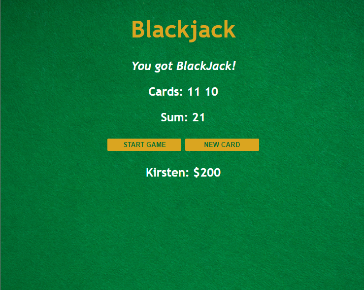

# Blackjack Game 🃏
Welcome to Blackjack, the first game I've ever programmed! This game lets you play a simplified version of Blackjack where you try to get as close to 21 points as possible without going over. Test your luck and strategy in this classic card game!

## Play the Game 🎮
Click [HERE](https://blackjack-by-devkirstenm.netlify.app) to play the Blackjack game now on Netlify.

## Technologies Used 💻
- HTML
- CSS
- JavaScript

## Key Concepts 🧠 
Throughout this project, I've applied several fundamental concepts of programming, including:

- arrays
- objects
- booleans
- if else statements
- comparison operators
- logical operators
- for loops
- the Math object
- return statements

## How to Play 🃏
In this Blackjack game, you, the player, are aiming to achieve a card sum as close to 21 as possible without exceeding it. Here's a basic outline of how the game works:

1. You start with two random cards drawn from a standard deck of playing cards.
2. The values of cards are summed up, with numbered cards being worth their face value, face cards (Jack, Queen, King) worth 10, and the Ace worth 11.
3. You can choose to draw additional cards ("New Card") to increase your total.
If your total exceeds 21, you lose.
4. If your total reaches 21 with the first two cards, you win with a "BlackJack."

Good luck and have fun playing Blackjack!

## Credits 🙌
This project is a part of the [Learn JavaScript](https://scrimba.com/learn/learnjavascript) course on Scrimba. 
